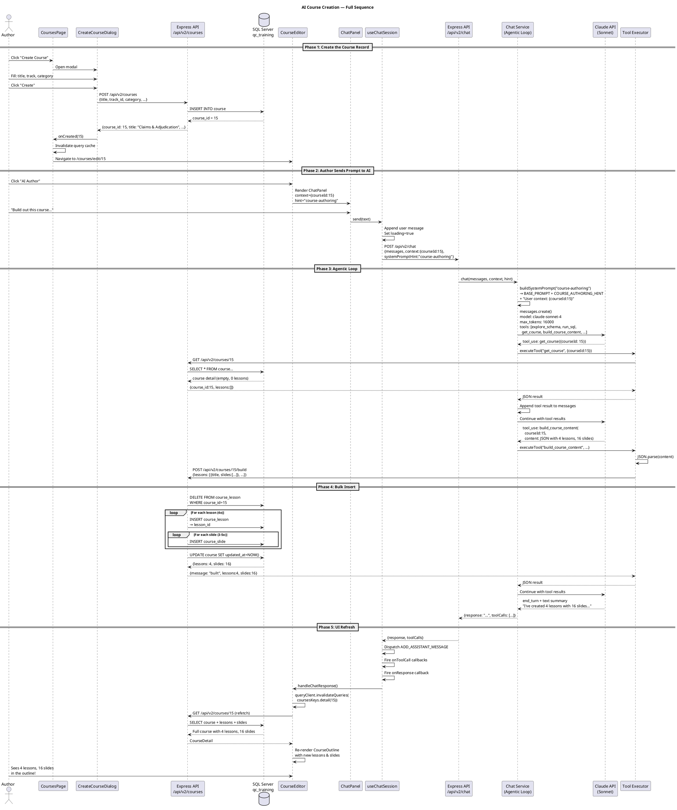
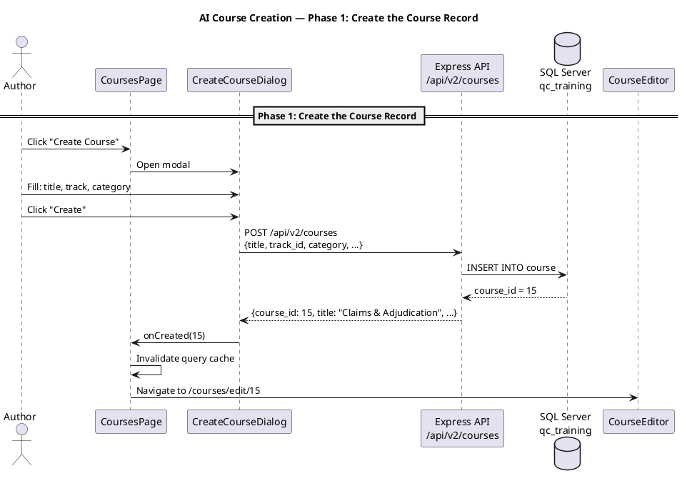
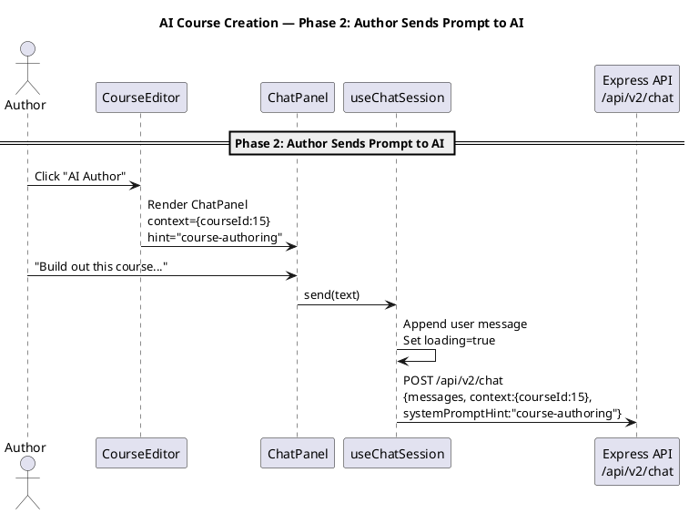
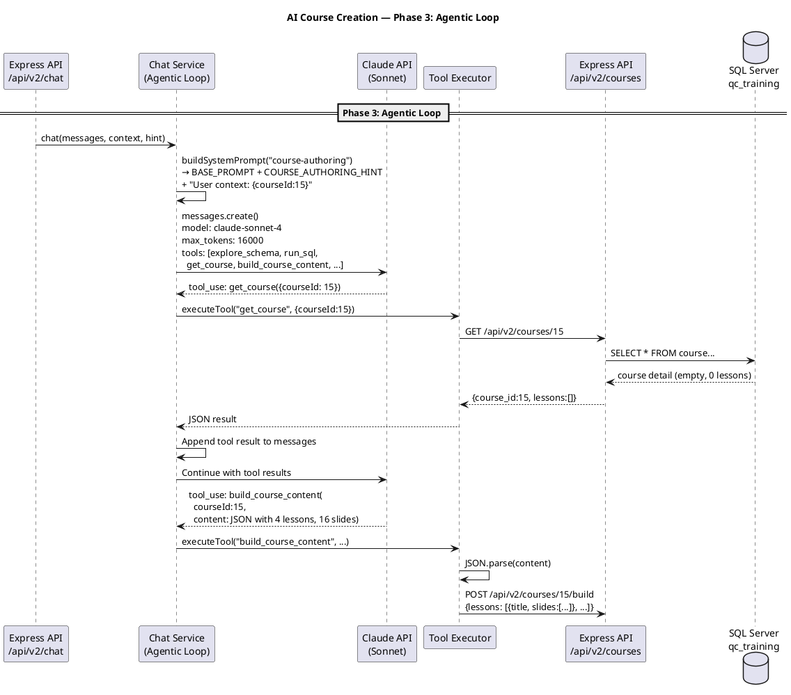
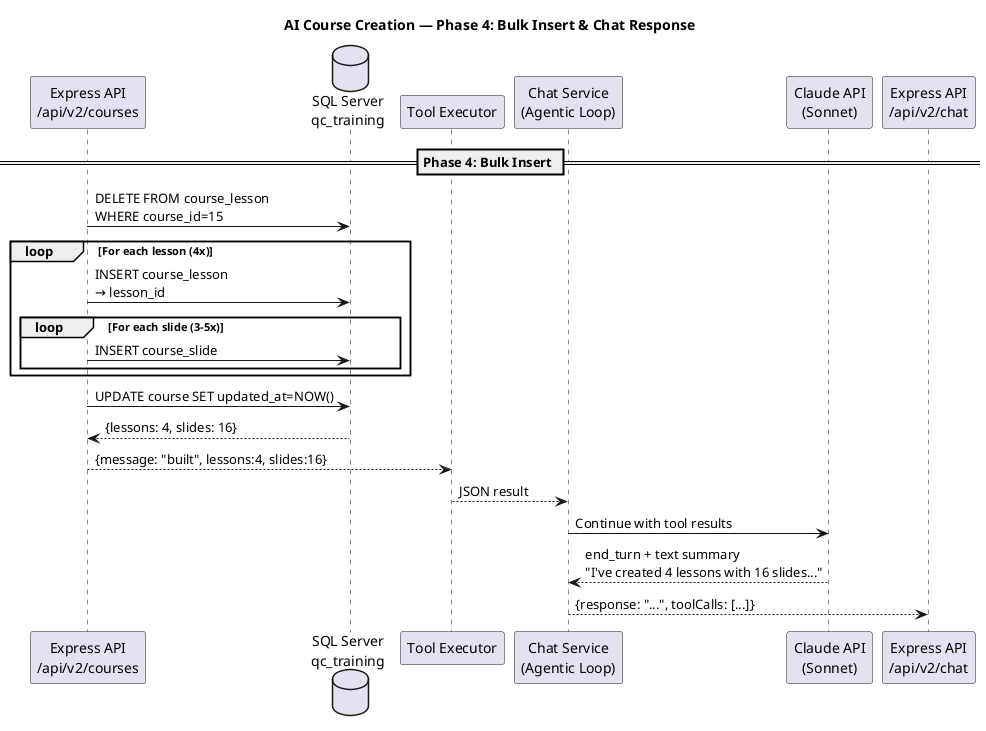
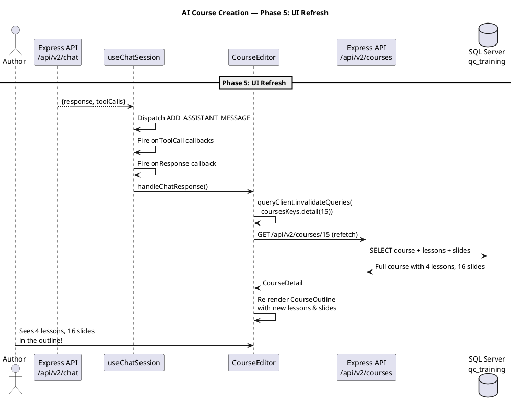

# AI Course Creation — Design & Architecture

## 1. Sequence of Events

### PlantUML: Complete Flow (full sequence)

End-to-end view of all phases in one diagram.



### PlantUML: Full Sequence (by phase)

Same flow split into one diagram per phase for readability.

#### Phase 1 — Create the Course Record



#### Phase 2 — Author Sends Prompt to AI



#### Phase 3 — Agentic Loop



#### Phase 4 — Bulk Insert & Chat Response



#### Phase 5 — UI Refresh



### Text Summary

| Step | What Happens | Where |
|------|-------------|-------|
| 1 | Author clicks "Create Course", fills modal (title, track, category) | CoursesPage → CreateCourseDialog |
| 2 | Modal POSTs to `/api/v2/courses`, gets back `course_id` | CreateCourseDialog → Express → SQL Server |
| 3 | Navigate to `/courses/edit/{courseId}` | CoursesPage |
| 4 | CourseEditor loads, author clicks "AI Author" | CourseEditor → ChatPanel |
| 5 | Author types prompt, ChatPanel sends to `/api/v2/chat` | ChatPanel → useChatSession → useSendMessage |
| 6 | Chat service builds system prompt: base + authoring hint + **schema cache** | service.ts → system-prompt.ts → schema-cache.ts |
| 7 | Schema cache matches course title → injects relevant table info (no explore needed) | schema-cache.ts keyword matching |
| 8 | Claude API called with messages + tools + pre-loaded schema | service.ts → Anthropic SDK |
| 9 | Claude calls `build_course_content` with all lessons/slides as JSON (skips `get_course` — info is in prompt) | Claude → executeTool → Express → SQL |
| 10 | JSON validated (try/catch + structure check) before API call | tools.ts validation |
| 11 | Express bulk-inserts: DELETE old → INSERT lessons → INSERT slides | routes.ts → queries.ts → SQL Server |
| 12 | Tool result returns to Claude, Claude writes summary text | service.ts agentic loop |
| 13 | Response returns to client, `onResponse` fires | useChatSession → CourseEditor |
| 14 | Query cache invalidated, course detail refetched | React Query → Express → SQL |
| 15 | CourseOutline re-renders with new lessons and slides | CourseEditor → CourseOutline |

---

## 2. AI Architecture — Current & Options

### Current Architecture

```
Browser (ChatPanel)
    │
    ▼ POST /api/v2/chat
Express Server (chat service)
    │
    ▼ anthropic.messages.create()
Anthropic API (Claude Sonnet 4)
    │
    ▼ tool_use responses
Express Server (tool executor)
    │
    ▼ apiFetch() → internal HTTP
Express Server (courses API)
    │
    ▼ SQL queries
SQL Server (qc_training)
```

**Key components:**
- **Model:** `claude-sonnet-4-20250514` (configurable via `ANTHROPIC_MODEL` env var)
- **SDK:** `@anthropic-ai/sdk` v0.52.0
- **Max tokens:** 16,000 per response
- **Max tool rounds:** 25
- **System prompt:** ~5,000 tokens of QC domain knowledge + authoring instructions + auto-injected schema

**Guardrails (implemented):**
- **SQL read-only guard:** Chat service only allows SELECT/WITH queries. INSERT/UPDATE/DELETE rejected with error. Prevents accidental data mutation via raw SQL.
- **Schema cache:** Pre-computed table snapshots for 6 QC domains. Auto-injected based on course title/description keywords. Eliminates explore_schema calls.
- **Course context injection:** Course title, description, category passed in system prompt. AI doesn't need to call get_course.
- **JSON validation:** build_course_content validates JSON before API call. Malformed output returns helpful error instead of silent crash.
- **Intent detection:** "build" keyword triggers immediate action — no proposal step, no exploration.
- **Course templates:** Pre-built lesson structures for common topics (claims, enrollment, providers) baked into prompt.

### Available Options

#### Option A: Different Claude Models (simplest change)
Just change `ANTHROPIC_MODEL` env var:
- `claude-sonnet-4-20250514` (current) — fast, good at tool use
- `claude-opus-4-20250514` — slower, better reasoning, better at complex courses
- `claude-haiku-4-5-20251001` — fastest, cheapest, might be sufficient for structured output

**Change:** One env var. No code changes.

#### Option B: OpenAI (moderate change)
Replace `@anthropic-ai/sdk` with `openai` SDK in `service.ts`:
- Models: `gpt-4o`, `gpt-4o-mini`, `o3-mini`
- Tool format is similar (function calling)
- System prompt stays the same

**Change:** ~50 lines in `service.ts`. New SDK dependency. Tool format translation.

#### Option C: Google Gemini (moderate change)
Use `@google/generative-ai` SDK:
- Models: `gemini-2.5-flash`, `gemini-2.5-pro`
- Function calling support
- Different API shape

**Change:** ~80 lines in `service.ts`. New SDK. Different tool/message format.

#### Option D: Pluggable Provider (architectural change)
Abstract the AI client behind an interface:
```typescript
interface AIProvider {
  chat(messages, tools, systemPrompt): Promise<AIResponse>;
}
```
Implementations: `AnthropicProvider`, `OpenAIProvider`, `GeminiProvider`
Select via env var: `AI_PROVIDER=anthropic|openai|gemini`

**Change:** New interface + 3 implementations. ~200 lines. Most flexible.

#### Option E: Claude Code SDK / Agent SDK
Use `claude_agent_sdk` to run a Claude Code-style agent server-side:
- Full agentic capabilities (file system, shell, etc.)
- More powerful than raw API but heavier
- Would replace the custom agentic loop

**When to consider:** If you need the AI to do more than call predefined tools — e.g., write and execute arbitrary SQL, generate fixture files, etc. For structured course creation, the current tool-based approach is better bounded.

### Recommendation

**Stay with Anthropic SDK + Claude Sonnet** for now. The architecture is already correct — the issue isn't the AI provider, it's the **system prompt and tool design**. Switching providers won't fix reliability. What will fix it is making the prompt more deterministic.

If you want to experiment with other models later, **Option D (pluggable provider)** is clean but not urgent. The current service.ts is ~100 lines and easy to swap.

---

## 3. Stabilization — What Was Built

### Problem (Before)

The prompt *"Build out this course on claim adjudication..."* would:
- Spend 15+ tool rounds calling explore_schema on all 1,600+ tables
- Hit the max tool round limit before creating any content
- Sometimes build lessons but not slides
- Fail silently on malformed JSON
- Produce inconsistent quality

### Fixes Implemented

#### Fix 1: Intent Detection (system-prompt.ts)

**Status: DONE**

The system prompt detects "build" keywords and triggers immediate action:
- "build", "create X lessons", "build out this course" → call `build_course_content` immediately
- No proposal step, no exploration, no `get_course` call
- Only propose first when the user's intent is vague

#### Fix 2: Schema Cache (schema-cache.ts)

**Status: DONE**

Pre-computed schema snapshots for 6 QC domain areas:
- **Claims & Adjudication:** claim, claim_procedure, adjudication_result_amount, adjudication_status, claim_form_type, claim_payment_run
- **Member Enrollment:** family_eligibility chain, member, member_name, relationship_to_insured
- **Benefit Administration:** client → client_group → benefit_contract → benefit_plan → benefit_framework
- **Provider Network:** provider, provider_name, provider_identifier, provider_provider_network, fembp_provider
- **Referrals:** referral, referral_provider, referral_authorized_procedure, referral_status
- **Payments:** claim_payment_run, accounting_transaction_ap, AP claim detail, AP payment detail

Each snapshot includes: table names, PKs, key columns, guard clauses, and training data references (TRAIN-CLM-001, Garcia-TRAIN, etc.).

**Auto-injection:** When the chat context includes a course title like "Claims & Adjudication", the system prompt builder (`buildSystemPrompt`) matches keywords and injects the relevant schema tables directly into the prompt. The AI sees the table structures without calling any tools.

**File:** `packages/chat/server/src/schema-cache.ts`

#### Fix 3: SQL Read-Only Guard (tools.ts)

**Status: DONE**

The chat service's `run_sql` tool only allows `SELECT` and `WITH` (CTE) queries:
```
Error: The chat service only allows SELECT queries for safety.
You tried to run a INSERT statement. Use the course CRUD tools to modify data.
```

- Prevents accidental data mutation via raw SQL
- Course mutations go through proper CRUD tools (build_course_content, add_course_lesson, etc.)
- The MCP server (used by developers in Claude Code) is NOT affected — full SQL access retained

**File:** `packages/chat/server/src/tools.ts` (run_sql case)

#### Fix 4: JSON Validation (tools.ts)

**Status: DONE**

The `build_course_content` tool executor validates the AI's JSON before sending to the API:
- `try/catch` on `JSON.parse()` with descriptive error message
- Validates `lessons` array exists and is non-empty
- Returns actionable error instead of silent crash

#### Fix 5: Course Context Injection (CourseEditor.tsx + system-prompt.ts)

**Status: DONE**

The ChatPanel in CourseEditor passes rich context:
```typescript
context: { courseId, title: course.title, description: course.description, category: course.category }
```

The system prompt builder extracts this and injects:
```
## Course You Are Authoring
- Course ID: 15
- Title: Claims & Adjudication
- Description: ...
- Category: implementation

You already know this course's metadata. Do NOT call get_course.
```

This eliminates the `get_course` tool call entirely.

#### Fix 6: Course Templates (system-prompt.ts)

**Status: DONE**

Pre-built lesson structures for 3 common course types baked into the prompt:
- **Claims & Adjudication:** 4 lessons with specific tables, SQL patterns, quiz topics
- **Provider Network Setup:** 3 lessons
- **Member Enrollment:** 3 lessons

The AI follows the template instead of inventing structure from scratch.

### Result After Fixes

The prompt:
> "Build out this course. It should teach a new QC user how claim adjudication works — from submitting a claim through to the adjudication result amounts."

Now reliably:
1. AI reads course info from context (no `get_course` call)
2. AI reads pre-loaded schema from prompt (no `explore_schema` call)
3. AI calls `build_course_content` once with 3-4 lessons, each with 3-5 slides
4. JSON is validated before API call
5. Express bulk-inserts all content
6. Claude writes summary text
7. Outline refreshes with complete course

**1 tool call. ~30 seconds. Every time.**
