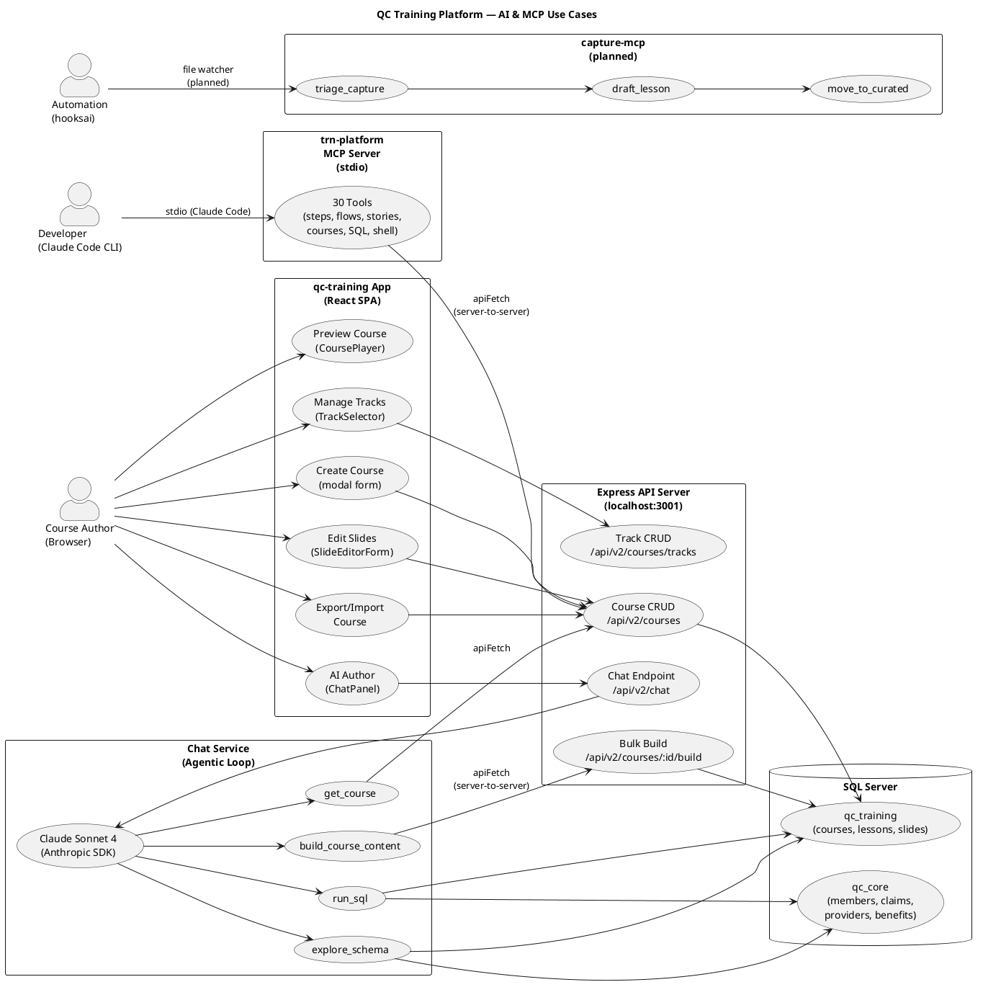
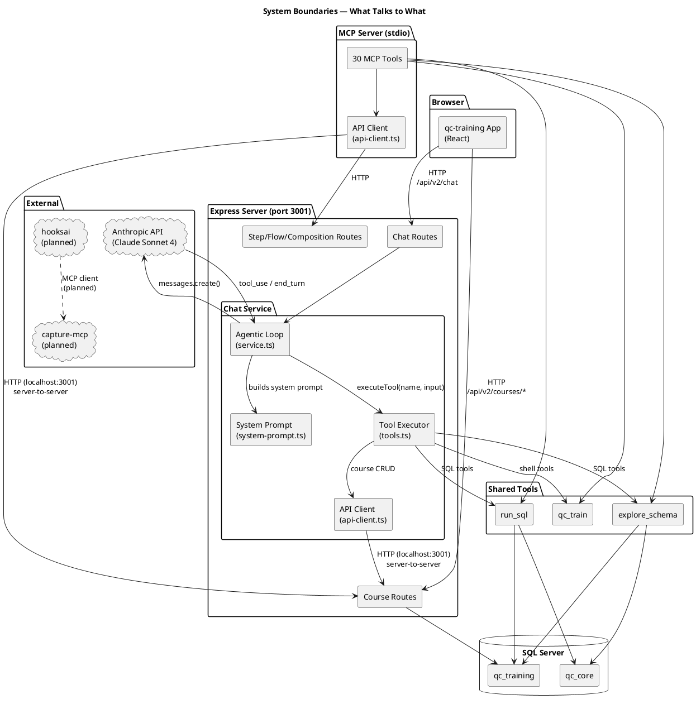
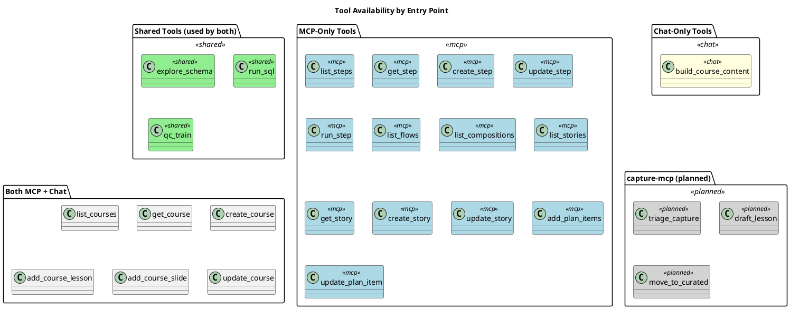

# MCP & AI Architecture — QC Training Platform

## Overview

The qc-training app has two AI integration paths and three MCP-capable servers. This document maps who uses what, through which path, and for what purpose.

## Use Case Diagram



## System Boundary Diagram



## Three AI Entry Points

| Entry Point | Who Uses It | How It Connects | Tools Available |
|---|---|---|---|
| **Chat Service** (HTTP) | Course Author via browser | ChatPanel → POST /api/v2/chat → Claude API → tool executor | 11 tools: schema, SQL, shell, course CRUD, bulk build |
| **trn-platform MCP** (stdio) | Developer via Claude Code CLI | .mcp.json → stdio → MCP server → shared tools + Express API | 30 tools: all domains (steps, flows, compositions, stories, courses, SQL, shell) |
| **capture-mcp** (planned) | hooksai / Claude Code | File watcher → MCP tools for screenshot triage/processing | triage_capture, draft_lesson, move_to_curated |

## Tool Overlap



## Data Flow: Who Calls What

```
┌─────────────────────────────────────────────────────────────────┐
│                        SQL Server                               │
│  ┌──────────────┐  ┌──────────────┐                             │
│  │  qc_training  │  │   qc_core    │                             │
│  └──────┬───────┘  └──────┬───────┘                             │
│         │                  │                                     │
│         └────────┬─────────┘                                     │
│                  │                                               │
├──────────────────┼───────────────────────────────────────────────┤
│     Shared Tool Executors                                        │
│     (explore_schema, run_sql, qc_train)                         │
│                  │                                               │
│         ┌────────┴────────┐                                      │
│         │                 │                                      │
│    ┌────┴────┐      ┌────┴────┐                                  │
│    │  Chat   │      │  MCP    │                                  │
│    │ Service │      │ Server  │                                  │
│    │(11 tools)│     │(30 tools)│                                  │
│    └────┬────┘      └────┬────┘                                  │
│         │                 │                                      │
│    ┌────┴────┐           │                                      │
│    │ Claude  │           │                                      │
│    │ Sonnet  │           │                                      │
│    └────┬────┘           │                                      │
│         │                 │                                      │
│    ┌────┴────────────────┴────┐                                  │
│    │     Express API          │                                  │
│    │   (localhost:3001)       │                                  │
│    │  /api/v2/courses/*      │                                  │
│    │  /api/v2/chat           │                                  │
│    │  /api/v2/steps/*        │                                  │
│    └──────────┬──────────────┘                                  │
│               │                                                  │
├───────────────┼──────────────────────────────────────────────────┤
│               │                                                  │
│    ┌──────────┴──────────┐         ┌─────────────┐              │
│    │  qc-training App    │         │ Claude Code  │              │
│    │  (Browser, React)   │         │ (CLI, stdio) │              │
│    └──────────┬──────────┘         └──────┬──────┘              │
│               │                           │                      │
│          ┌────┴────┐                ┌────┴────┐                  │
│          │ Course  │                │Developer│                  │
│          │ Author  │                │         │                  │
│          └─────────┘                └─────────┘                  │
└─────────────────────────────────────────────────────────────────┘
```

## Key Takeaways

1. **The qc-training app does NOT use MCP directly.** It uses the Chat Service via HTTP (`POST /api/v2/chat`), which wraps Claude API with an agentic tool loop.

2. **The MCP server is for Claude Code (CLI).** When you (the developer) run Claude Code, it connects to the trn-platform MCP server over stdio and gets 30 tools.

3. **Both Chat and MCP share the same 3 core tools** (explore_schema, run_sql, qc_train) via shared executors in `packages/shared/src/tools/`.

4. **Both Chat and MCP proxy CRUD through Express.** Neither talks to SQL Server directly for course/step/flow operations — they call the Express API at localhost:3001.

5. **capture-mcp and hooksai are planned** but not yet integrated. They will add screenshot processing capabilities accessible from both the app (via chat tools) and automation (via hooksai file watchers).

6. **Express is the central hub.** Every data mutation goes through it, regardless of whether the caller is the browser, the chat service, or the MCP server.
