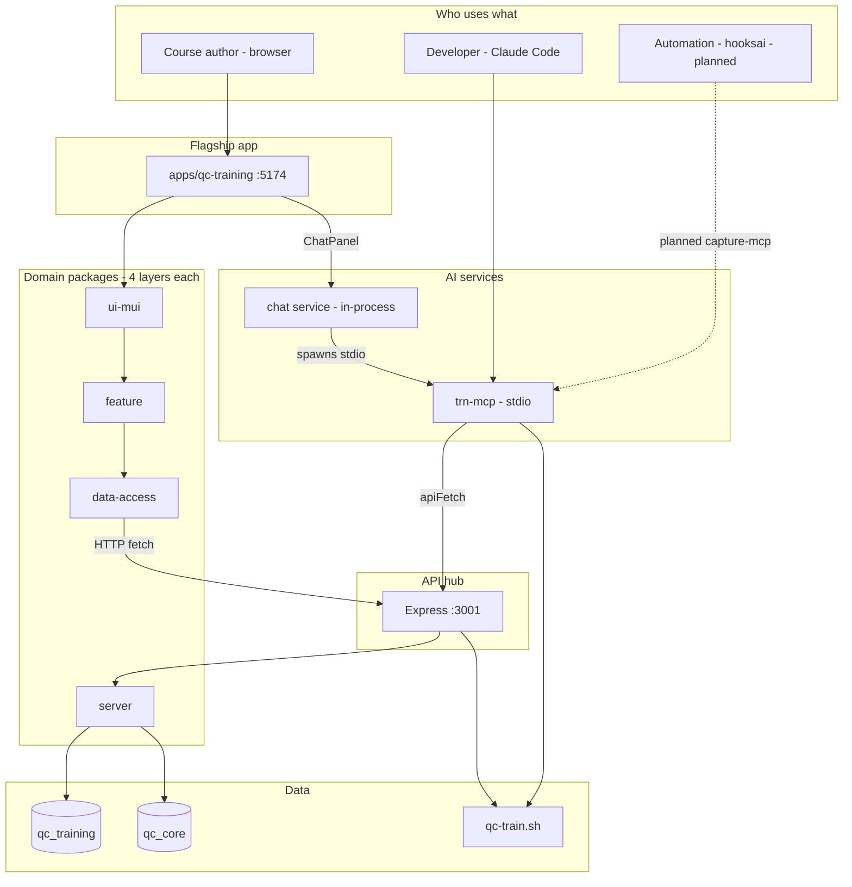

# TRN Platform Architecture — qc-training & Services

> **Purpose:** Onboarding and orientation for how the monorepo fits together — flagship app, domain layers, API hub, MCP, chat, and planned external integrations.
>
> **Related:** [[north-star]] · [[mcp-architecture]] · [[pipeline-guide]] · [[sql-server-config]] · [[courses-domain-design]]

---

## Big picture

TRN Platform is a **Training & Demo platform for QC (Quality Care)** systems. It lets authors:

- Build reusable **steps** (SQL, shell, manual actions)
- Chain them into **flows** with pause points
- Wrap flows in **compositions** (narrative training stories)
- Run live demos against **SQL Server** (`qc_training` + `qc_core`)
- Author structured **courses** (lessons, slides, tracks)

The north-star vision lives in `docs/trn-platform/0-vision/north-star.md`: strict TypeScript, 4-layer domains, Storybook-driven development, and SQL Server as the data backbone.



---

## The flagship app: `apps/qc-training`

**Role:** Product shell — routing, MUI theme, TanStack Query, and page wrappers that import `@trn-platform/*-ui-mui` components.

| Concern | Where |
|--------|--------|
| Entry | `apps/qc-training/src/main.tsx` → `src/App.tsx` |
| Dev server | Vite on **port 5174** |
| Default home | **Courses** tab (`/courses`) |
| Dev-only tabs | Steps, Flows, Workbench (hidden unless toggled in the app bar) |

### Routes (simplified)

| Path | Purpose |
|------|---------|
| `/courses` | Course library (default) |
| `/courses/edit/:id`, `/courses/play/:id` | Course editor & player |
| `/flows/dev/:id`, `/flows/run/:id` | Flow builder & runner |
| `/compositions/edit\|run\|play/:id` | Composition authoring & training |
| `/workbench/:stepId` | Step workbench |
| `/capture-demo` | In-app feedback capture demo |

**Note:** `chat` and `stories` packages exist; pages like `NewCoursePage` / `StoriesPage` are written but **not wired into `App.tsx` routes yet**. Courses is the primary product surface today.

### How qc-training talks to the backend

- All domain hooks use `VITE_API_URL` (default `http://localhost:3001`)
- Requests go to `/api/v2/{domain}/...` with cookies (`credentials: 'include'`)
- Local dev: `AUTH_DISABLED=true` in root `.env` — no login UI; server injects a dev user
- Run everything: `pnpm dev:qc` (Express + qc-training)

**qc-training does not speak MCP.** It only uses HTTP. MCP is for developers (Claude Code) and indirectly for the in-app AI chat.

---

## Domain architecture (the core pattern)

Every domain follows the same **4 layers**. Dependencies flow downward only:

```
server → data-access → feature → ui-mui
         ↑ shared types/schemas/constants
```

| Layer | Responsibility | Example |
|-------|----------------|---------|
| `server/` | Express routes + raw SQL | `packages/steps/server` |
| `data-access/` | TanStack Query hooks, `fetch` to API | `packages/courses/data-access` |
| `feature/` | Business logic, derived state | `packages/flows/feature` |
| `ui-mui/` | MUI components + Storybook stories | `packages/courses/ui-mui` |

### Rules that matter

- UI should use **feature** hooks when they exist (don't skip layers)
- Domains never import sibling domains
- Import from package roots: `@trn-platform/shared`, not deep paths
- Exception: `@trn-platform/shared/db` and `@trn-platform/shared/tools` for server-side use

### The 7 domains (+ shared)

| Domain | Purpose |
|--------|---------|
| **steps** | Reusable step library (SQL, shell, manual) |
| **flows** | Ordered step sequences with pause points |
| **compositions** | Narrative + embedded flows (training stories) |
| **execution** | Live runs, SSE streaming, pause/resume/abort |
| **courses** | Tracks, lessons, slides/blocks, templates, import/export |
| **stories** | Narrative plans (story + plan items) |
| **chat** | AI course authoring via agentic loop |
| **shared** | Zod schemas, types, DB pools, shared tools |

### Two product modes

1. **Demo lab** — steps → flows → compositions → execution (Garcia/Miller QC scenarios, live SQL, `qc-train.sh`)
2. **Course authoring** — courses + chat AI (structured lessons for training material)

---

## Services (beyond the browser UI)

### 1. Express API server (the hub)

**Port 3001** — everything mutates through here.

| Entry | When used |
|-------|-----------|
| `server-dev.cjs` | `pnpm server:dev`, `pnpm dev:qc` (dev, loads package **source**) |
| `server/src/index.ts` | Production build (`pnpm server:build`) |

**Mounted routes** (all behind auth except health):

| Mount | Domain |
|-------|--------|
| `GET /api/health` | DB connectivity check (no auth) |
| `/api/v2/steps` | Step library CRUD |
| `/api/v2/flows` | Flows + ordering |
| `/api/v2/compositions` | Compositions + blocks |
| `/api/v2/execute` | Runs, SQL, SSE events, abort/resume |
| `/api/v2/chat` | AI chat + plan mode |
| `/api/v2/stories` | Stories + plan items |
| `/api/v2/courses` | Full course CMS (tracks, lessons, build, templates) |

**Databases:** `qc_training` (authoring/training data) and `qc_core` (production-like member/claim reference data). No ORM — parameterized raw SQL via `mssql`.

**Real-time:** The `execution` domain streams output over **Server-Sent Events** at `GET /api/v2/execute/events`.

**Dev vs prod entry gaps (as of this doc):**

- `server-dev.cjs` includes upload routes; production `server/src/index.ts` includes feedback capture routes — align when testing capture in dev.

---

### 2. `trn-mcp` — MCP server for developers

| Item | Value |
|------|--------|
| Package | `packages/mcp-server` |
| Binary | `trn-mcp` (after build) |
| Transport | stdio (Claude Code, Cursor, etc.) |
| Config | `.mcp.json` at repo root |

**What it does:** Exposes ~26 tools so AI assistants can operate the platform without the browser.

| Category | Tools (examples) |
|----------|------------------|
| Direct DB/shell | `explore_schema`, `run_sql`, `qc_train` |
| Steps | `list_steps`, `create_step`, `run_step`, … |
| Browse | `list_flows`, `list_compositions` |
| Stories | `list_stories`, `create_story`, `add_plan_items`, … |
| Courses | `list_courses`, `create_course`, `build_course_content`, templates, … |

MCP tools call the **same Express API** the UI uses (`packages/mcp-server/src/util/api-client.ts`). Flow/composition **writes** exist on the API but are mostly **not** exposed as MCP tools yet (list-only for flows/compositions).

**Deep dive:** `docs/trn-platform/4-reference/mcp-architecture.md`

---

### 3. Chat service — AI inside the product (not a separate process)

| Item | Value |
|------|--------|
| Package | `packages/chat/server` |
| Mount | `/api/v2/chat` |

When a user opens the AI chat panel (e.g. course authoring):

1. Browser → `POST /api/v2/chat`
2. Chat service spawns the **same MCP server** as a child over stdio
3. Claude (Anthropic SDK) runs an agentic loop with a **filtered subset** of MCP tools (~14 tools)
4. Guardrails: `run_sql` only allows `SELECT`/`WITH`; step/flow/story tools excluded from browser chat

**Two AI audiences:**

| Audience | Path | Tool access |
|----------|------|-------------|
| Developer | Claude Code → MCP stdio | Full ~26 tools, unfiltered SQL |
| Course author | Browser → `/api/v2/chat` → MCP child | Courses + schema + safe SQL + `qc_train` |

---

### 4. In-app feedback capture (in-repo, not capture-mcp)

| Piece | Path |
|-------|------|
| App code | `apps/qc-training/src/capture/` |
| API | `POST /api/v2/feedback` (`server/src/capture/feedback.ts`) |
| Demo | `/capture-demo` |

Captures DOM screenshots + action metadata. Separate from the external **capture-mcp** project.

---

### 5. External / planned integrations

| System | Repo | Planned role |
|--------|------|--------------|
| **capture-mcp** | `inner-agility.dev/capture-mcp` | Snagit screenshots → triage, draft lessons, curated course assets |
| **hooksai** | `inner-agility.dev/hooksai` | File watcher → trigger capture-mcp on new screenshots |
| **Legacy QC Training Lab** | `client-development-tickets/.../QC-Training/web` | Old Express :3847 app wrapping `qc-train.sh` — trn-platform **replaces** this pattern |

Specs: `docs/trn-platform/1-specs/ai-guided-course-authoring.md`

---

## Other apps in the monorepo

| App | Role |
|-----|------|
| **`apps/qc-training`** | Flagship product UI |
| **`apps/component-demo`** | Component playground (excluded from default `pnpm build`) |
| **Storybook** (root `.storybook/`) | Design/dev workflow — 5 training journeys, visual regression, MSW mocks |

| Command | What runs |
|---------|-----------|
| `pnpm dev:qc` | Express :3001 + qc-training :5174 |
| `pnpm dev` | Express + Storybook :6006 |
| `pnpm storybook` | Storybook only |

---

## End-to-end examples

### Run a training flow in qc-training

1. User opens `/flows/run/:flowId`
2. `flows-ui-mui` → `flows-feature` → `execution-data-access`
3. `POST /api/v2/execute/flow/:flowId`
4. `execution/server` runs steps (SQL via pools, shell via `qc-train.sh`)
5. Output streams via SSE `GET /api/v2/execute/events`
6. UI shows live console, pause/resume, status panels

### AI builds course content

1. User opens course editor + ChatPanel
2. `POST /api/v2/chat`
3. Chat spawns MCP, calls e.g. `build_course_content` → `POST /api/v2/courses/:id/build`
4. Data lands in `qc_training` tables the manual editor uses

---

## Quick reference: what runs where

| Service | Port / transport | Started by |
|---------|------------------|------------|
| qc-training (Vite) | `:5174` | `pnpm dev:qc` |
| Express API | `:3001` | `pnpm server:dev` or `pnpm dev:qc` |
| Storybook | `:6006` | `pnpm storybook` |
| trn-mcp | stdio | `.mcp.json`, or chat service spawn |
| SQL Server | env `DB_*` | external |
| `qc-train.sh` | shell | execution domain + `qc_train` MCP tool |

### Key environment variables (`.env.example`)

| Variable | Purpose |
|----------|---------|
| `VITE_API_URL` | Browser → Express (default `http://localhost:3001`) |
| `API_URL` | MCP / server-to-server |
| `AUTH_DISABLED=true` | Local dev auth bypass |
| `DB_*`, `DB_QC_TRAINING_DATABASE`, `DB_QC_CORE_DATABASE` | SQL Server |
| `SHELL_WRAPPER` | Path to `qc-train.sh` for shell execution |
| `ANTHROPIC_API_KEY`, `ANTHROPIC_MODEL` | Chat service |

---

## Mental model (one sentence each)

- **qc-training** — thin product shell over domain UI packages
- **Domain packages** — reusable 4-layer modules (the real architecture)
- **Express** — single API hub all clients share
- **MCP** — developer/automation bridge to that same API (+ direct SQL/shell)
- **Chat** — browser-safe subset of MCP for course authors
- **capture-mcp / hooksai** — planned screenshot → course pipeline, not in-repo yet

---

## Workspace layout (reference)

```
trn-platform/
├── apps/
│   ├── qc-training/          # Flagship Vite app
│   └── component-demo/       # Demo app
├── packages/
│   ├── shared/               # Schemas, types, db, tools
│   ├── mcp-server/           # trn-mcp (stdio)
│   └── {domain}/             # steps, flows, compositions, execution,
│       ├── server/           #   chat, stories, courses
│       ├── data-access/
│       ├── feature/
│       └── ui-mui/
├── server/                   # Root Express entry, middleware, migrations
├── server-dev.cjs            # Dev server (source aliases)
└── .storybook/               # Storybook + workflow stories
```
