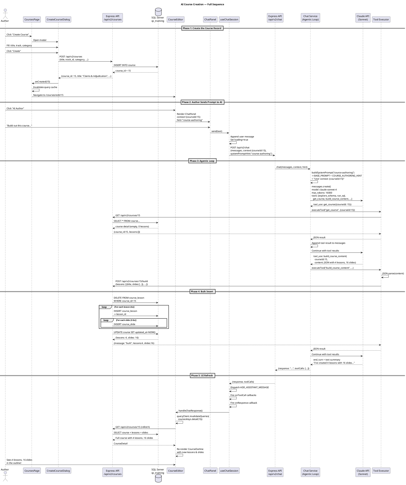
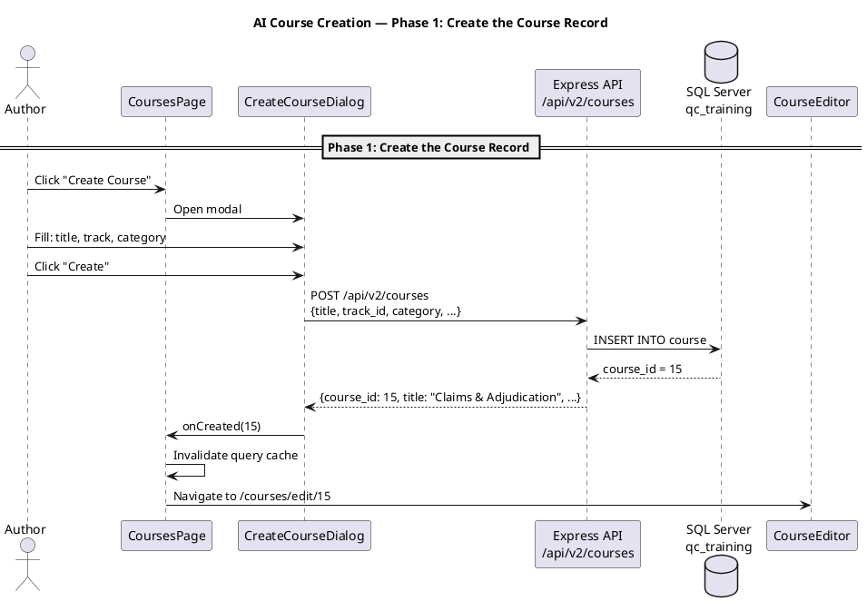
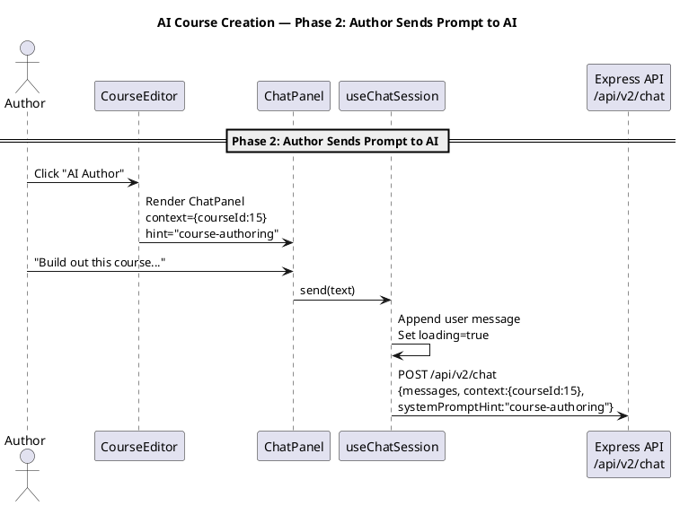
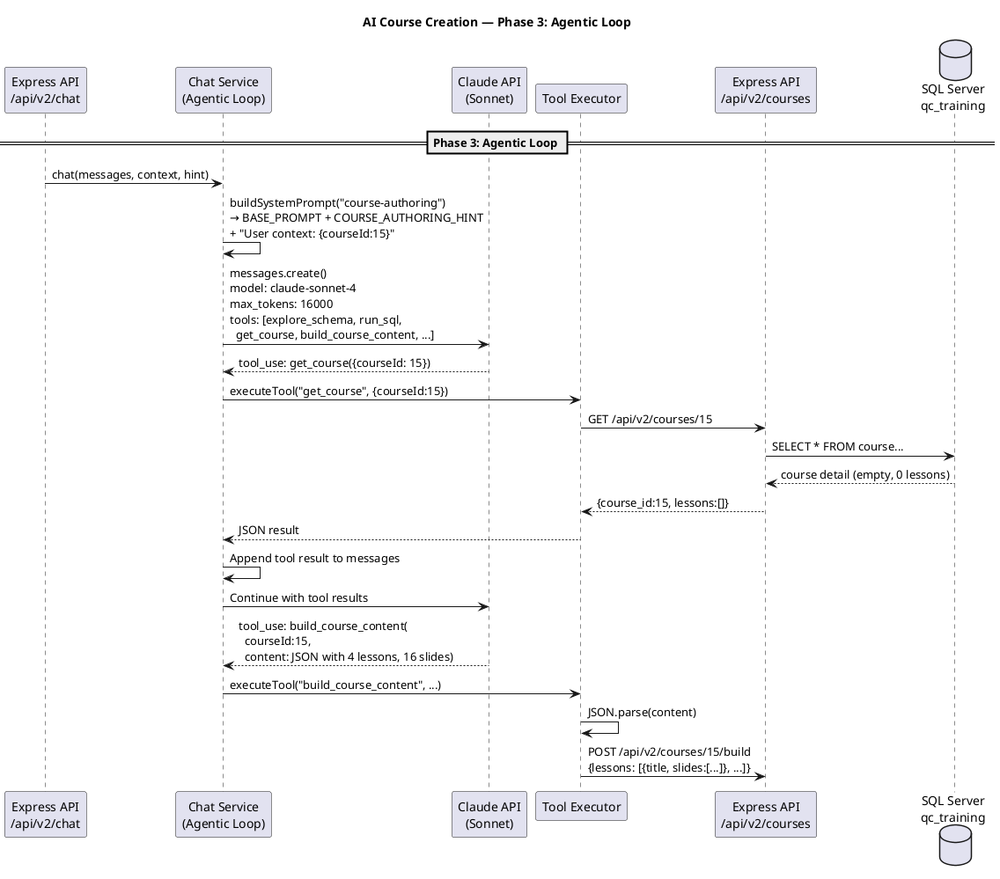
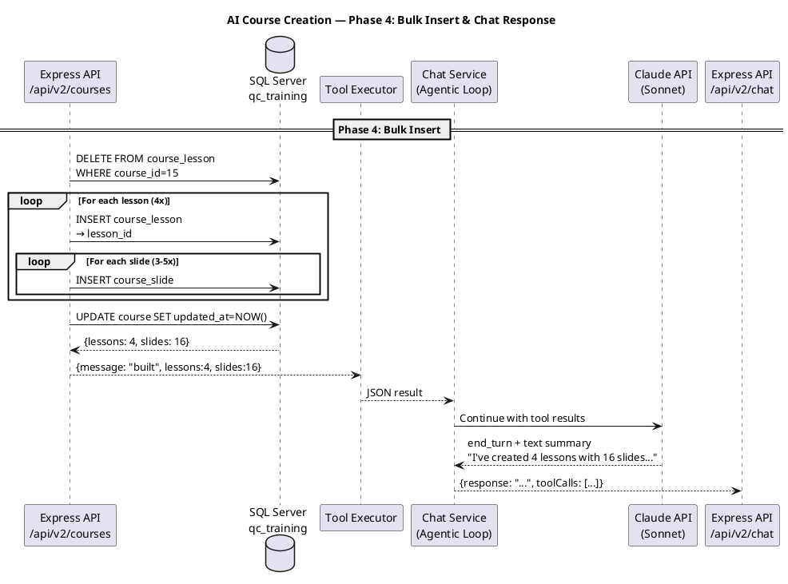
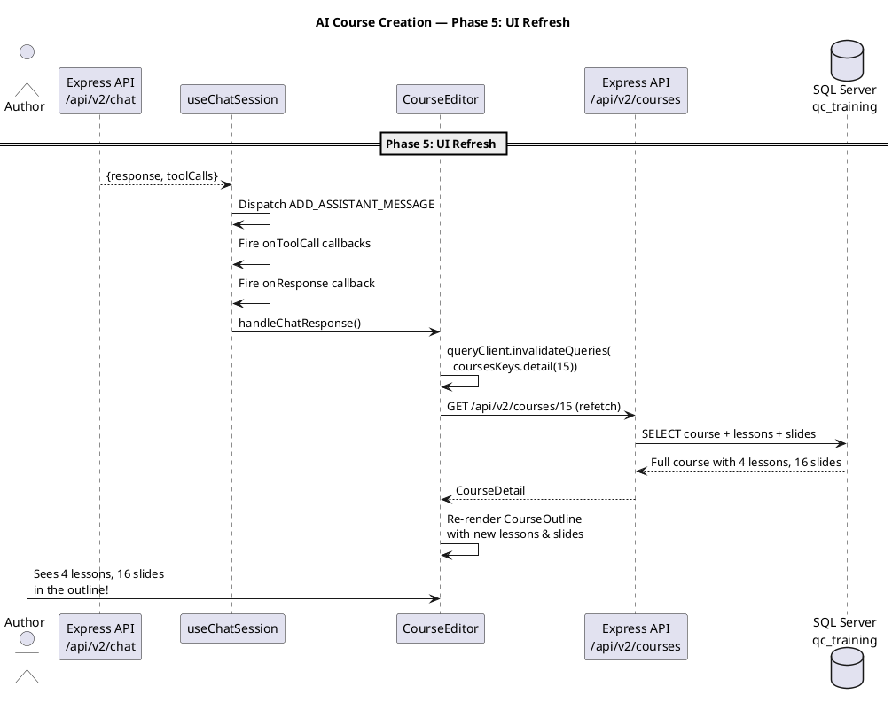

# AI Course Creation — Design & Architecture

## 1. Sequence of Events

### PlantUML: Complete Flow (full sequence)

End-to-end view of all phases in one diagram.



### PlantUML: Full Sequence (by phase)

Same flow split into one diagram per phase for readability.

#### Phase 1 — Create the Course Record



#### Phase 2 — Author Sends Prompt to AI



#### Phase 3 — Agentic Loop



#### Phase 4 — Bulk Insert & Chat Response



#### Phase 5 — UI Refresh



### Text Summary

| Step | What Happens | Where |
|------|-------------|-------|
| 1 | Author clicks "Create Course", fills modal (title, track, category) | CoursesPage → CreateCourseDialog |
| 2 | Modal POSTs to `/api/v2/courses`, gets back `course_id` | CreateCourseDialog → Express → SQL Server |
| 3 | Navigate to `/courses/edit/{courseId}` | CoursesPage |
| 4 | CourseEditor loads, author clicks "AI Author" | CourseEditor → ChatPanel |
| 5 | Author types prompt, ChatPanel sends to `/api/v2/chat` | ChatPanel → useChatSession → useSendMessage |
| 6 | Chat service builds system prompt with course-authoring knowledge | service.ts → system-prompt.ts |
| 7 | Claude API called with messages + tools | service.ts → Anthropic SDK |
| 8 | Claude calls `get_course` to see current state | Claude → executeTool → Express → SQL |
| 9 | Claude calls `build_course_content` with all lessons/slides as JSON | Claude → executeTool → Express → SQL |
| 10 | Express bulk-inserts: DELETE old → INSERT lessons → INSERT slides | routes.ts → queries.ts → SQL Server |
| 11 | Tool result returns to Claude, Claude writes summary text | service.ts agentic loop |
| 12 | Response returns to client, `onResponse` fires | useChatSession → CourseEditor |
| 13 | Query cache invalidated, course detail refetched | React Query → Express → SQL |
| 14 | CourseOutline re-renders with new lessons and slides | CourseEditor → CourseOutline |

---

## 2. AI Architecture — Current & Options

### Current Architecture

```
Browser (ChatPanel)
    │
    ▼ POST /api/v2/chat
Express Server (chat service)
    │
    ▼ anthropic.messages.create()
Anthropic API (Claude Sonnet 4)
    │
    ▼ tool_use responses
Express Server (tool executor)
    │
    ▼ apiFetch() → internal HTTP
Express Server (courses API)
    │
    ▼ SQL queries
SQL Server (qc_training)
```

**Key components:**
- **Model:** `claude-sonnet-4-20250514` (configurable via `ANTHROPIC_MODEL` env var)
- **SDK:** `@anthropic-ai/sdk` v0.52.0
- **Max tokens:** 16,000 per response
- **Max tool rounds:** 25
- **System prompt:** ~3,000 tokens of QC domain knowledge + authoring instructions

### Available Options

#### Option A: Different Claude Models (simplest change)
Just change `ANTHROPIC_MODEL` env var:
- `claude-sonnet-4-20250514` (current) — fast, good at tool use
- `claude-opus-4-20250514` — slower, better reasoning, better at complex courses
- `claude-haiku-4-5-20251001` — fastest, cheapest, might be sufficient for structured output

**Change:** One env var. No code changes.

#### Option B: OpenAI (moderate change)
Replace `@anthropic-ai/sdk` with `openai` SDK in `service.ts`:
- Models: `gpt-4o`, `gpt-4o-mini`, `o3-mini`
- Tool format is similar (function calling)
- System prompt stays the same

**Change:** ~50 lines in `service.ts`. New SDK dependency. Tool format translation.

#### Option C: Google Gemini (moderate change)
Use `@google/generative-ai` SDK:
- Models: `gemini-2.5-flash`, `gemini-2.5-pro`
- Function calling support
- Different API shape

**Change:** ~80 lines in `service.ts`. New SDK. Different tool/message format.

#### Option D: Pluggable Provider (architectural change)
Abstract the AI client behind an interface:
```typescript
interface AIProvider {
  chat(messages, tools, systemPrompt): Promise<AIResponse>;
}
```
Implementations: `AnthropicProvider`, `OpenAIProvider`, `GeminiProvider`
Select via env var: `AI_PROVIDER=anthropic|openai|gemini`

**Change:** New interface + 3 implementations. ~200 lines. Most flexible.

#### Option E: Claude Code SDK / Agent SDK
Use `claude_agent_sdk` to run a Claude Code-style agent server-side:
- Full agentic capabilities (file system, shell, etc.)
- More powerful than raw API but heavier
- Would replace the custom agentic loop

**When to consider:** If you need the AI to do more than call predefined tools — e.g., write and execute arbitrary SQL, generate fixture files, etc. For structured course creation, the current tool-based approach is better bounded.

### Recommendation

**Stay with Anthropic SDK + Claude Sonnet** for now. The architecture is already correct — the issue isn't the AI provider, it's the **system prompt and tool design**. Switching providers won't fix reliability. What will fix it is making the prompt more deterministic.

If you want to experiment with other models later, **Option D (pluggable provider)** is clean but not urgent. The current service.ts is ~100 lines and easy to swap.

---

## 3. Stabilization Plan

### The Problem

The prompt *"Build out this course on claim adjudication..."* sometimes:
- Spends too many rounds exploring before building
- Builds lessons but not slides
- Hits context limits on large courses
- Produces inconsistent quality

### Root Causes

1. **The AI has too much freedom.** The system prompt says "propose first" which causes back-and-forth. For a prompt that says "build this course", the AI should just build it.
2. **`build_course_content` takes a massive JSON string.** If the AI's JSON is malformed or truncated, the whole call fails silently.
3. **The system prompt encodes patterns but not a template.** The AI knows the rhythm (narrative → demo → quiz) but has to invent the content structure each time.

### Fixes

#### Fix 1: Detect "build" intent and skip conversation

When the user says "Build out this course" or "Create a 3-lesson course", the AI should NOT propose first — it should immediately call `build_course_content`. Add to the system prompt:

```
### When to Build Immediately

If the user's message contains "build", "create X lessons", or provides a detailed
outline, skip the proposal step and call build_course_content directly.
Only propose first when the user's intent is vague ("I want to teach adjudication").
```

#### Fix 2: Pre-built course templates in the system prompt

Instead of the AI inventing structure, give it a concrete template for common course types:

```
### Claim Adjudication Course Template

When asked about claims/adjudication, use this structure:
Lesson 1: "What Is a Claim?" — narrative (claim table structure), live_demo (TRAIN-CLM-001), quiz
Lesson 2: "Claim Procedure Lines" — narrative (claim_procedure), live_demo (procedure query), quiz
Lesson 3: "The Adjudication Math" — narrative (adjudication_result_amount breakdown), live_demo (verify numbers), quiz
Lesson 4: "Payment Run" — narrative (claim_payment_run chain), live_demo (payment query), quiz
```

#### Fix 3: Validate JSON before sending to API

In the `build_course_content` tool executor, add validation:
```typescript
case 'build_course_content': {
  let parsed;
  try {
    parsed = JSON.parse(input.content as string);
  } catch {
    return 'Error: Invalid JSON. Please check your content format.';
  }
  if (!Array.isArray(parsed.lessons) || parsed.lessons.length === 0) {
    return 'Error: content must have a non-empty lessons array.';
  }
  // ... proceed with API call
}
```

#### Fix 4: Increase max_tokens for build responses

When the AI is generating a full course JSON (which can be 5,000+ tokens), 16,000 max_tokens should be sufficient but we should monitor. Consider bumping to 32,000 for the authoring hint.

### Expected Result After Fixes

The prompt:
> "Build out this course. It should teach a new QC user how claim adjudication works — from submitting a claim through to the adjudication result amounts."

Should reliably:
1. Call `get_course` once (see it's empty)
2. Call `build_course_content` once with 3-4 lessons, each with 3-5 slides
3. Return a text summary
4. Outline refreshes with complete course

**2 tool calls. ~30 seconds. Every time.**
